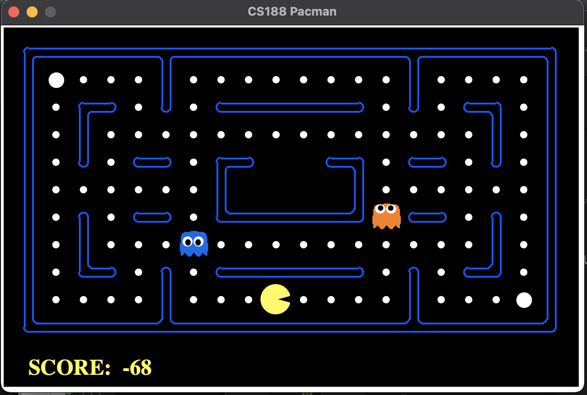

# Pacman Agent - Teaching a machine to play Pacman

- __Original author:__ Daniel Saromo
- __Student:__ Gabriel Pila

This project is part of the Diploma of Development of Applications with Artificial Intelligence. 

The activity requested to students was to develop and implement a machine learning model to define the movement of the pacman agent. 

To run the script which allows the pacman agent to move according to what the model mandates, please use the following instructions.

__Instructions:__
1. Clone the repository
2. Enter the repository folder: `cd pacman-project`
3. Create a virtual environment: `virtualenv venv`
4. Activate the virtual environment: `source venv/bin/activate`
5. Install the necessary packages: `pip install -r requirements.txt`
6. Run `python pacman.py -p my_ML_Agent`
7. The pacman agent should be moving according to the model implemented.

__Files Modified:__

- `iapucp_agents.py`: Implementación de `get_actions`
- `pacman.py`: Adición de paquetes necesarios
- `pacman_extraeFeatures.py`: Implementación de filtro de partidas ganadas.

__UPDATE:__
- Se hizo una mejora al código de procesamiento de Features, de manera que si la partida resultó perdida, no se considerarán los registros de esa partida como parte del dataset de entrenamiento. 